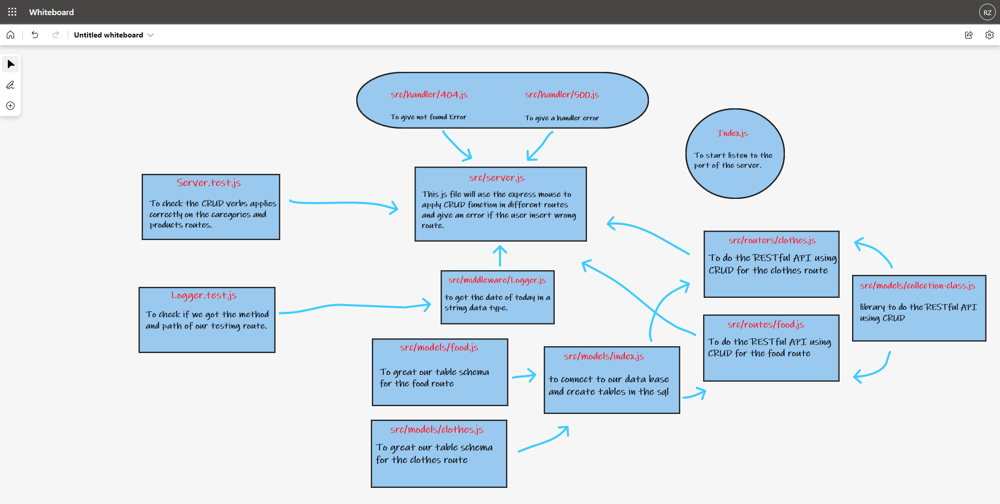

# api-server

## Author: Rami Zregat

## Project: Data Modeling

## Lab 4

**Description of today lab:**   
Today’s lab adds no new requirements to the API server. Our goal today is to swap out the route handler functions in favor of a Collection Interface which will consume a Sequelize Model and perform generic Database CRUD operations. You should consider this a “refactor” of your previous assignment, but treat this as a new build – do not simply copy your previous files and start working. Rebuild the server, re-asserting your knowledge of how it works, how it’s architected, and how to operate it.

## Links to check:    

- Heroku application for main branch: https://ramizregat-api-server.herokuapp.com/

- Github actions link: https://github.com/RamiZregat/api-server/actions 

- Github pull request link: https://github.com/RamiZregat/api-server/pull/2

## Dependencies:
- dotenv
- express
- jest
- supertest
- pg
- sequelize
- sequelize-cli
- sqlite3

## How to start the server:  
- pgstart
- npm start

## What should I run on the terminal or postman?
- npm run test / on the terminal
- POST - http://localhost:3030/food
- GET - http://localhost:3030/food
- GET - http://localhost:3030/food/1
- PUT - http://localhost:3030/food/1
- DELETE - http://localhost:3030/food/1
- POST - http://localhost:3030/clothes
- GET - http://localhost:3030/clothes
- GET - http://localhost:3030/clothes/1
- PUT - http://localhost:3030/clothes/1
- DELETE - http://localhost:3030/clothes/1

## UML

